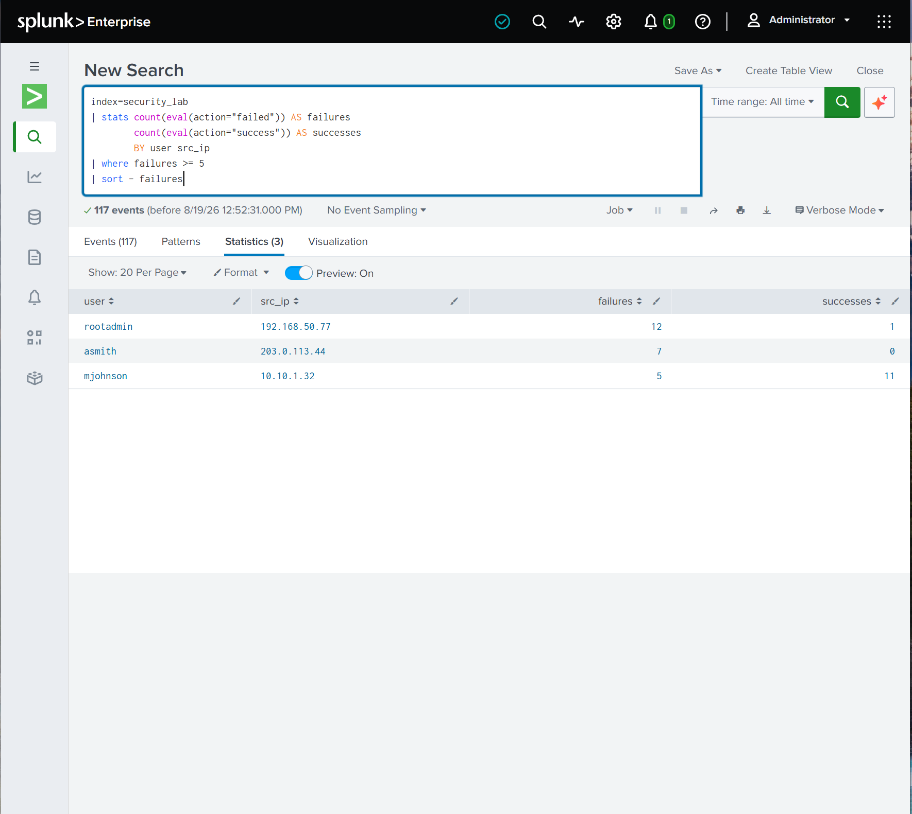
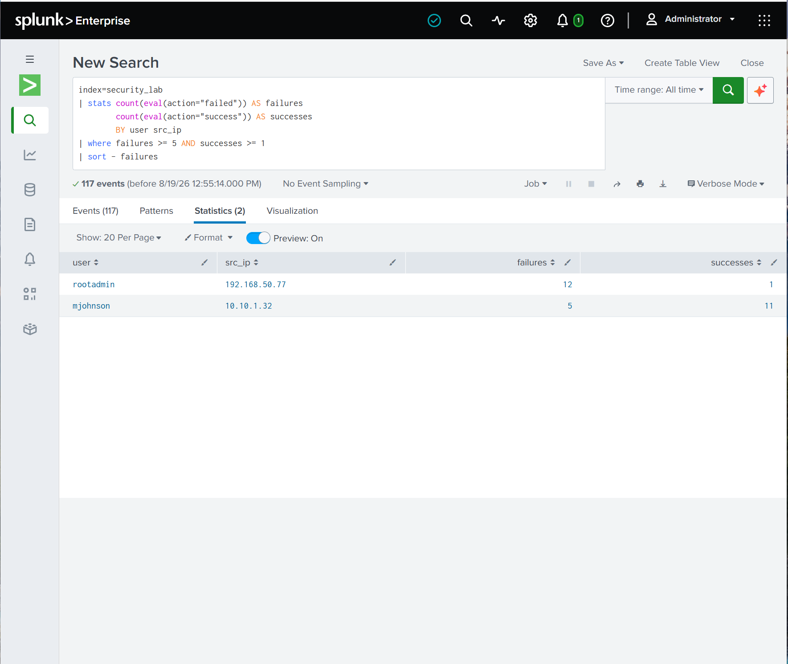
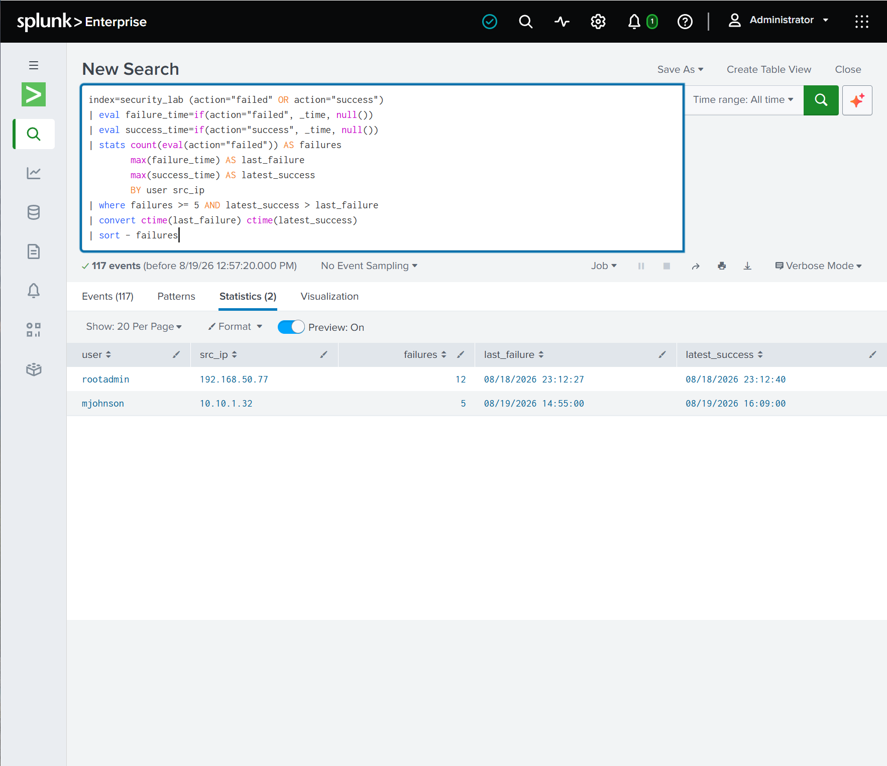
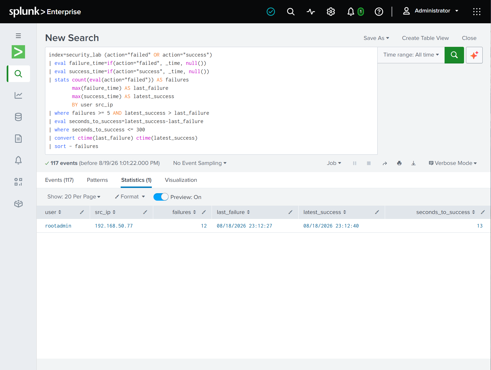
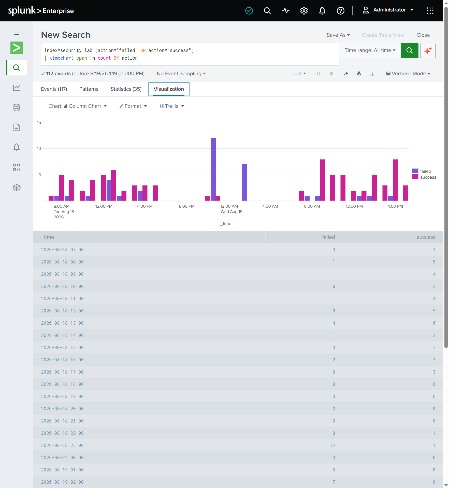
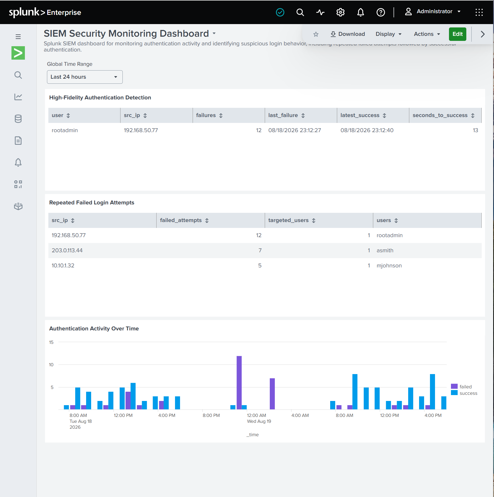

# Splunk SIEM Security Monitoring Lab

## Project Overview

This project demonstrates a hands-on security monitoring lab built in Splunk Enterprise. I created and refined SPL searches to analyze authentication activity, identify repeated failed login attempts, correlate failed logins with subsequent successful authentication, and present the findings in a SIEM-style monitoring dashboard.

The project demonstrates the process of moving from broad authentication analysis to a higher-fidelity detection designed to reduce false positives and highlight potentially suspicious login behavior.

## Objectives

- Analyze authentication events in Splunk
- Identify repeated failed login attempts
- Evaluate source IP addresses associated with authentication failures
- Correlate multiple failed logins with a subsequent successful login
- Tune detection logic to improve alert fidelity
- Visualize authentication activity over time
- Build a SIEM-style security monitoring dashboard

## Tools & Technologies

- Splunk Enterprise
- Search Processing Language (SPL)
- SIEM monitoring concepts
- Authentication log analysis
- Detection engineering
- Event correlation
- Security data visualization

## Detection Process

### 1. Initial Authentication Analysis

Authentication events were analyzed to establish normal activity and identify patterns of failed and successful login attempts.

### 2. Repeated Failed Login Detection

The detection logic was refined to identify source IP addresses generating multiple failed authentication attempts.

### 3. Failure-to-Success Correlation

Authentication failures were correlated with subsequent successful authentication events. This helps identify behavior that may warrant additional investigation, such as repeated failed attempts followed by a successful login.

### 4. High-Fidelity Detection Tuning

The SPL logic was further tuned to focus on higher-confidence authentication activity and reduce unnecessary results.

## Authentication Activity Over Time

Authentication events were also aggregated over time to visualize failed and successful login activity and make unusual spikes easier to identify.

## Final SIEM Dashboard

The completed Splunk dashboard combines multiple authentication monitoring views, including high-fidelity authentication detection, repeated failed login attempts, and authentication activity over time.

## SPL Searches

The repository includes the SPL searches used to build the detections and visualizations:

- `authentication-activity-over-time.spl`
- `high-fidelity-authentication-detection.spl`
- `repeated-failed-login-attempts.spl`

These searches demonstrate authentication monitoring, aggregation, threshold-based detection, event correlation, and detection tuning using Splunk SPL.

## Skills Demonstrated

- SIEM monitoring
- Splunk SPL
- Log analysis
- Authentication monitoring
- Detection engineering
- Event correlation
- Failed login investigation
- Detection tuning
- Security dashboard development
- Data visualization

## Key Takeaway

This project demonstrates how authentication logs can be transformed into actionable security detections. Rather than relying only on individual failed login events, I used aggregation, thresholds, correlation, and timing relationships to identify higher-risk authentication behavior and present the results through a centralized SIEM monitoring dashboard.
